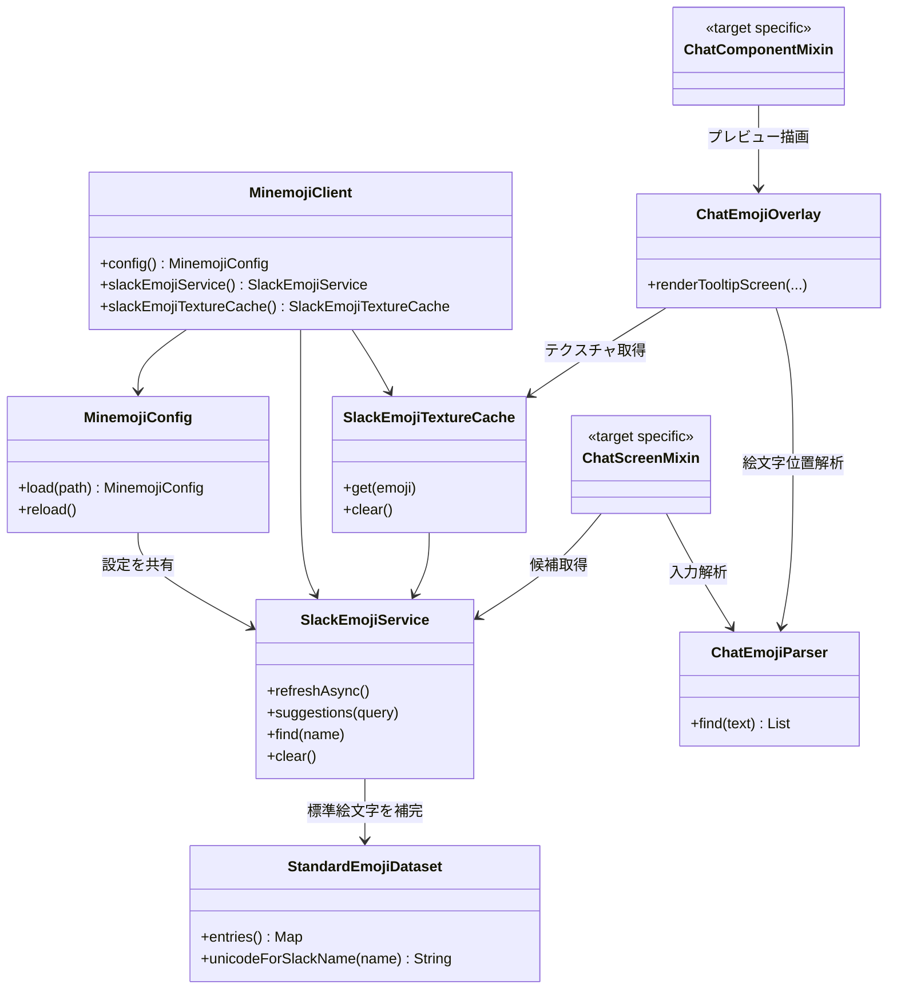

# クラス構造

共通処理は `common` に集約し、Minecraftの描画・Mixin・テクスチャ登録など、Minecraft APIに依存する処理は `targets/mc-*` に分離する。

`ChatComponentMixin`、`ChatScreenMixin`、`ChatEmojiOverlay`、`SlackEmojiTextureCache` はMinecraftバージョンごとに実装を持つ。特に描画APIと現在画面の取得方法はターゲット側で吸収し、Slack連携や絵文字名の解決ロジックは共通実装を使う。
